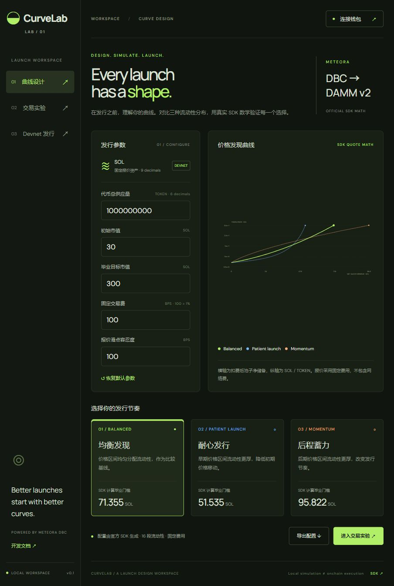

# CurveLab

[View the pitch deck (PDF)](CurveLab.pdf) · [Download editable slides](CurveLab.pptx)



A working Meteora DBC launch-design workspace. Compare official SDK curve configurations, run identical buy/sell scenarios, export reproducible parameters, and prepare wallet-signed launches on Solana Devnet.

## Run locally

Requires Node.js 22+ and npm.

```powershell
git clone https://github.com/hanxia24-afk/curvelab.git
cd curvelab
npm ci
npm run dev
```

Open http://localhost:5173. The local server binds to 127.0.0.1. Keep the Node process running. `npm run build` checks TypeScript and builds the frontend; the built static frontend still requires the API server. This is a local MVP, not a public production deployment.

```powershell
npm test
npm run build
```

Optional: set `SOLANA_RPC_URL` to a Devnet RPC endpoint before starting the server. API endpoints that access the chain verify the Devnet genesis hash and reject other networks. The default is `https://api.devnet.solana.com`.

## Features

- Three real `buildCurveWithLiquidityWeights` presets, each with 16 liquidity weights: equal, decreasing, increasing.
- Configurable supply, initial and graduation market caps (denominated in SOL), fixed DBC fees and quote slippage.
- Chart of token price versus net quote reserve, derived from official SDK pre-launch exact-input quotes.
- Sequential buy/sell simulations with SDK `swapQuote`, token balance validation, fixed fee accounting, and minimum received quantities.
- JSON exports for SDK configuration and experiments. BN fields are decimal strings; reconstruct BN instances before passing exported config to SDK transaction builders.
- Local parameter persistence; wallet keys never stored by the application.
- Phantom connection, transaction preparation, Devnet preflight, wallet signature, message integrity verification, submission and confirmation.
- Devnet base-mint lookup and raw pool/config export; link to Meteora's official manual DAMM v2 migrator.

## Deliberate MVP scope

- Quote mint: wrapped SOL only. Base token: SPL, six decimals, immutable authority option.
- DBC fixed fee only; dynamic fees and time schedules are disabled.
- Supply leftover parameter: 1% of supply. SDK computes final reserve/leftover behavior; actual leftover received can differ because of curve rounding and migration buffers.
- Creator gets 50% of distributable DBC trading fees after protocol allocation. The connected wallet is also the partner fee claimer and leftover receiver.
- Migration destination DAMM v2, fixed 0.3% fee, 100% creator LP permanently locked. A token creator must understand this irreversible LP configuration before signing.
- Simulation has a single trader, updates sqrt price/net quote reserve/holdings, and rejects trades beyond the DBC boundary. It does not simulate external traders, MEV, network fees, DAMM trading, profitability or future demand.
- No onchain swap interface, automatic migration, metadata hosting, paid marketplace or mainnet mode.
- Charts use 60 near-graduation samples; the final sampled point is 99.9% of the computed reserve threshold. Currency conversion uses SPL six decimals / quote nine decimals. Small raw amounts undergo protocol integer rounding.

## Devnet launch

Open the app in a normal browser with Phantom installed, switch the wallet to Devnet, fund it with test SOL, and connect. Choose a preset and token identity. Generate and preflight the transaction, review the summary, then sign in the wallet. The server returns a confirmed transaction link and mint address. Unsigned requests fail preflight when the payer lacks funds.

Devnet does not have the mainnet automatic migration keeper. Actual graduation needs adequate purchases and a manual migration transaction. The default scenario is a design example, not a low-cost graduation demo; its computed thresholds are around 52–96 SOL. Use smaller initial/graduation market caps for Devnet experiments.

## Validation evidence

- Six engine tests cover unit conversion, monotonic curves, distinct thresholds, SDK quote consistency, round-trip conservation, sequential balances and invalid trades.
- TypeScript check and Vite production build passed. Five HTTP API checks passed (analysis, scenario, invalid config, untrusted origin, unknown route).
- Browser verification covered the design chart, shared four-trade scenario, comparison results and launch form.
- Devnet RPC responded successfully and the SDK constructed a two-instruction config/pool transaction without broadcasting it. Independent test-wallet faucet request failed with an RPC internal error, so no onchain launch or DAMM migration is claimed. See `devnet-evidence.json`.
- `scripts/devnet-smoke.mjs` creates an isolated Devnet-only test wallet in ignored `.local/`, requests test SOL, and attempts config/pool creation and readback. Never put real funds in that wallet. Run `node scripts/devnet-smoke.mjs` to retry after faucet recovery.

## Dependency status

`npm audit fix` was attempted. `audit-report.json` records 13 remaining upstream advisories (6 high, 7 moderate), including dependencies of Meteora SDK / Anchor / Solana web3. Native bigint bindings were not compiled; the SDK uses its JavaScript fallback. Breaking upgrades were not forced because they can break SDK compatibility. Public/mainnet release requires dependency review and further chain integration testing.

## Architecture

`src/main.tsx` / `src/style.css`: React interface. `engine.mjs`: official SDK curve/quote adapter and scenario accounting. `server.mjs`: local HTTP JSON API and Vite middleware; holds only ephemeral mint/config signing keys until returning the partially signed creation transaction, with no persistent signer service. The wallet supplies the payer signature. Prepared message hashes are checked before submission.

## Reference

- https://github.com/MeteoraAg/dynamic-bonding-curve-sdk
- https://docs.meteora.ag/developer-guides/dbc
- https://docs.meteora.ag/developer-guides/damm-v2
- https://migrator.meteora.ag/


